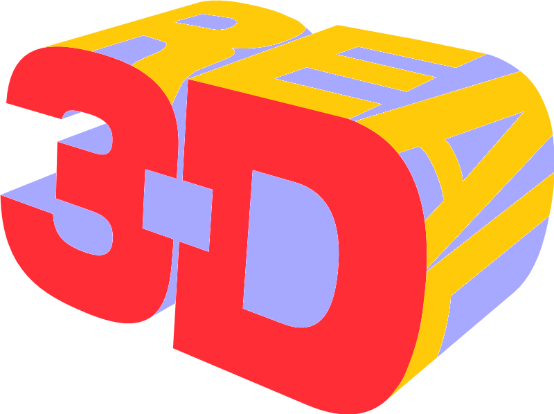

# Supermodel: A Sega Model 3 Arcade Emulator
*Copyright 2003-2023 The Supermodel Team*

## Overview

[Supermodel](https://supermodel3.com) emulates Sega's Model 3 arcade platform, allowing you to relive state-of-the-art 3D arcade gaming as it existed from 1996 through 1999. It uses OpenGL, [SDL2](https://libsdl.org), and can run on Windows, Linux, and macOS. It also supports network play on low-latency network connections. The source code is freely available under the terms of the [GNU General Public License](http://www.gnu.org/copyleft/gpl.html).

<p align="center">
   
   
</p>

 Model 3 first made its debut in 1996 with Virtua Fighter 3 and Scud Race, and for the subsequent three years boasted the most powerful 3D hardware of any gaming platform. Developed by Real3D, then a Lockheed Martin company, and with a heritage rooted in advanced flight simulator technology, Model 3 featured capabilities that would not appear on PCs for several years. Using an on-board scene graph and geometry processor, it could store, transform, light, and rasterize tens of thousands of polygons per frame at a fluid 57.524 frames per second.

The aim of the Supermodel project is to develop an emulator that is both accurate and playable. As with virtually all arcade hardware, no public documentation for the Model 3 platform exists. What is known so far has been painstakingly reverse engineered from scratch.

## How To Get It

Windows builds are updated automatically and available on the official Supermodel [download page](https://supermodel3.com/Download.html). Linux and macOS users currently have to build from source.

## Build Instructions

### Windows

The preferred method for building Supermodel is to use GCC and MSYS2. After installing [MSYS2](https://msys2.org), open the MSYS2 shell and install the required dependencies using the pacman package manager:

- GCC (```mingw64/mingw-w64-x86_64-gcc```)
- Make (```mingw64/mingw-w64-x86_64-make```)
- SDL2 (```mingw64/mingw-w64-x86_64-SDL2```, ```mingw64/mingw-w64-x86_64-SDL2_net```)

This can be done using the following commands:

```
pacman -S mingw64/mingw-w64-x86_64-gcc
pacman -S mingw64/mingw-w64-x86_64-make
pacman -S mingw64/mingw-w64-x86_64-SDL2
pacman -S mingw64/mingw-w64-x86_64-SDL2_net
```

At this point, you can continue using either the MSYS2 shell or Windows Command Prompt but ensure that both ```gcc``` and ```mingw32-make``` are in your path. In MSYS2, the location of these binaries will be ```/mingw64/bin``` and for Command Prompt, assuming MSYS2 was installed in the default location, add ```C:\msys64\mingw64\bin``` to your Windows ```PATH``` variable.

To build Supermodel without network support, use:

```
mingw32-make -f Makefiles/Makefile.Win32
```

For network support:

```
mingw32-make -f Makefiles/Makefile.Win32 NET_BOARD=1
```

### Linux

Ensure SDL2 is installed. Most package managers ought to have this available. For example, on Ubuntu, it should be sufficient to run:

```
sudo apt install libsdl2-dev
sudo apt install libsdl2-net-dev
```

And then build Supermodel:

```
make -f Makefiles/Makefile.UNIX
```

For network support:

```
make -f Makefiles/Makefile.UNIX NET_BOARD=1
```

### macOS

Ensure Apple's Xcode Command Line Tools are installed:

From a terminal:
```
xcode-select --install
```

Ensure SDL2 is installed.  Download the latest *.dmg files from both of the links below, and install per the READMEs in the .dmgs (i.e. in "/Library/Frameworks")

* SDL2: https://github.com/libsdl-org/SDL/releases

* SDL_net: https://github.com/libsdl-org/SDL_net/releases


And then build Supermodel:

```
make -f Makefiles/Makefile.OSX
```

For network support:

```
make -f Makefiles/Makefile.OSX NET_BOARD=1
```

### Note: running on macOS
If you try and run a macOS binary that was downloaded from the internet and/or built on a different machine, you need to grant macOS permission to execute the binary (just 1-time):

* Open the folder containing the binary in Finder, and right (or ctrl) click on it:

* Click "Open" when the following dialogue box appears : "macOS cannot verify the developer of “supermodel-git-xxxx”. Are you sure you want to open it?"

* Close the terminal window that opens (after clicking open)

Details: https://support.apple.com/guide/mac-help/open-a-mac-app-from-an-unidentified-developer-mh40616/mac
